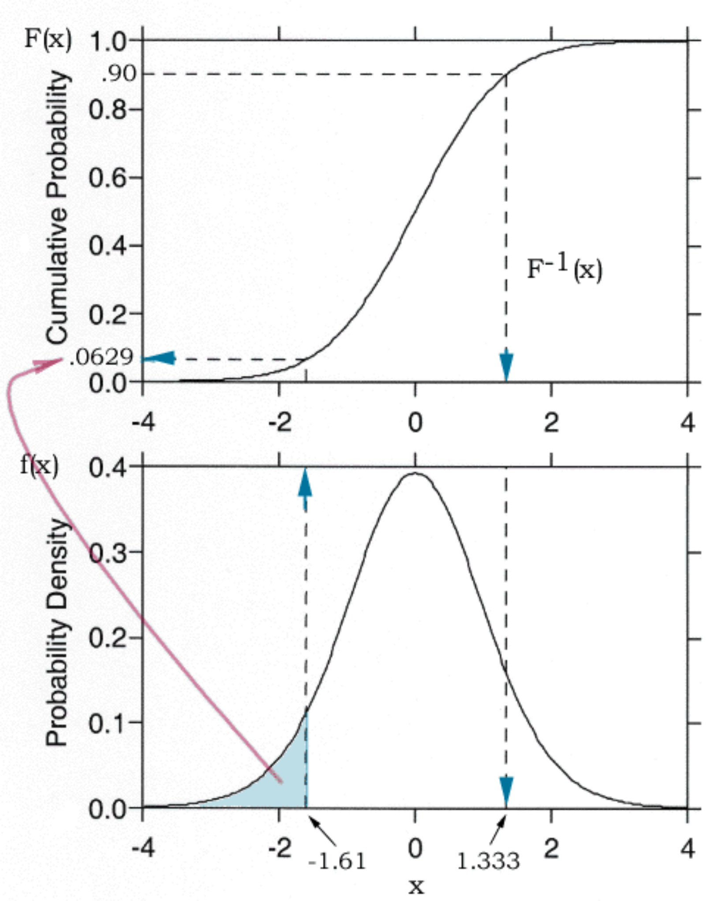

class: center, middle

# This is a very first test

## for us to see if this setup is usable

```{r setup, include=FALSE}
# don't mind this code chunk, it just sets up a few things for the rest
# it doesn't appear, because the include argument above is FALSE...
options(htmltools.dir.version = FALSE, servr.daemon = TRUE)
knitr::opts_chunk$set(cache=TRUE, autodep = TRUE, fig.retina = 3, message = FALSE, warning = FALSE)
old <- ggplot2::theme_set(iheiddown::theme_iheid())
```

```{r, load_refs, include=FALSE, cache=FALSE}
# Initializes the bibliography
library(RefManageR)
BibOptions(check.entries = FALSE,
           bib.style = "authoryear", # Bibliography style
           max.names = 3, # Max author names displayed in bibliography
           sorting = "nyt", #Name, year, title sorting
           cite.style = "authoryear", # citation style
           style = "markdown",
           hyperlink = FALSE,
           dashed = FALSE)
myBib <- ReadBib("bib/myBibClass1.bib", check = FALSE)
# Note: don't forget to clear the knitr cache to account for changes in the
# bibliography.
```

---
## Who we are: Andreas 

.pull-left[
.polaroid[]

Andreas Haupt
]

.pull-right[
Sociologist and Assistant Professor (Akad. Oberrat) at the Karlsruhe Institut of Technology. 

* Studies income and wage distributions 
* Gender inequalities
* Poverty
]


---
## Who we are: Sebastian 

.pull-left[
.polaroid[]


Sebastian Wenz
]

.pull-right[
Sociologist and Deputy head of team "Knowledge Exchange and Outreach" 

* Sociology of education
* Discrimination
* Causal inference
]

---
class: show-only-last-code-result
## Distribution Functions

**Distribution functions** are commonly defined as: 


$$ F_X(x)=P(X \leq x) $$ 

The left hand side represents the probability, that an element of X takes a value less or equal to x. 

.center[
```{r, echo=FALSE, fig.height=6}

# create sample data 
sample_Data = rnorm(500) 
  
# calculate CDF  
CDF <- ecdf(sample_Data ) 
# draw the cdf plot 
plot( CDF , main="Cummulative Distribution")
```
]


---
## Test

Das ist ein Test 

$$ P(Y) = Y_i + 1 $$ 
---
# Inverse CDFs
.center[
```{r, echo=FALSE, out.width="35%", fig.cap="The relation between the CDF and inverse CDF"}

```
]

---
# Partitioning a distribution

We can chop a distribution in different parts. Tradition has it that according to the number of parts, we call the parts differently. 

```{r table2, echo=FALSE, message=FALSE, warnings=FALSE, results='asis'}
tabl <- "
| Number of parts               | Term        |
|--------------------------|-------------|
| 4                        | Quartile    |
| 5                        | Quintile    |
| 10                       | Decile      |
| 100 (from 1 to 100)      | Percentile  |
| 100 (from 0.01 to 1)     | Quantile    |
"
cat(tabl) # output the table in a format good for HTML/PDF/docx conversion
```

Within this seminar, we will use the terms *Percentile* and *Quantile* interchangeably. 
---
# References

```{r refs, echo=FALSE, results="asis"}
RefManageR::PrintBibliography(myBib)
```
